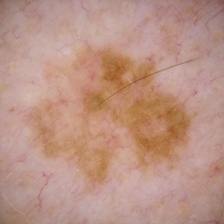
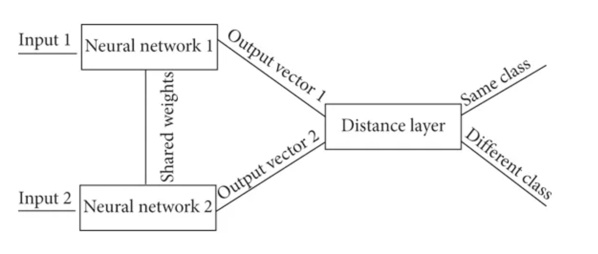
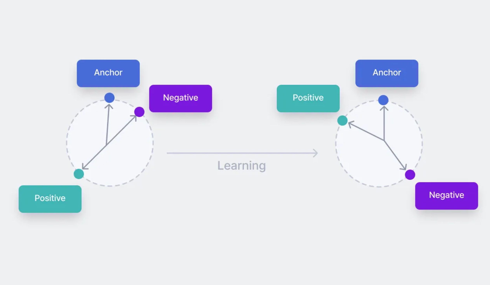
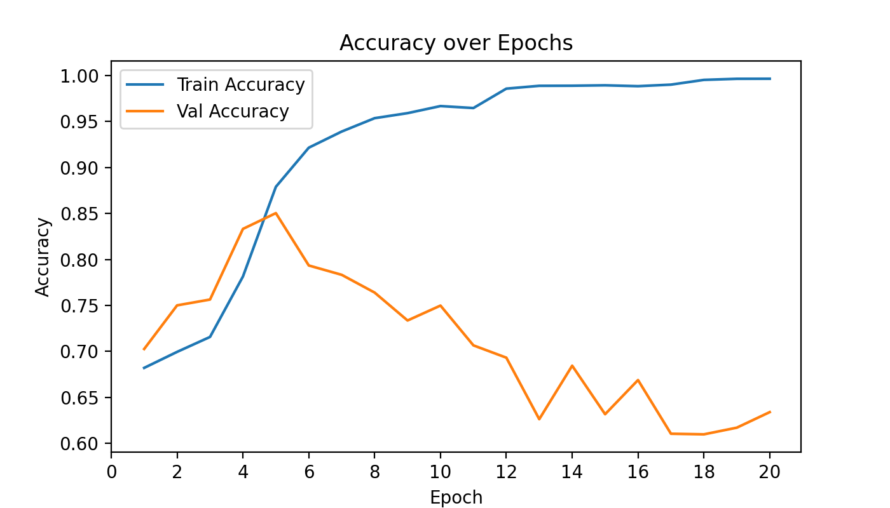
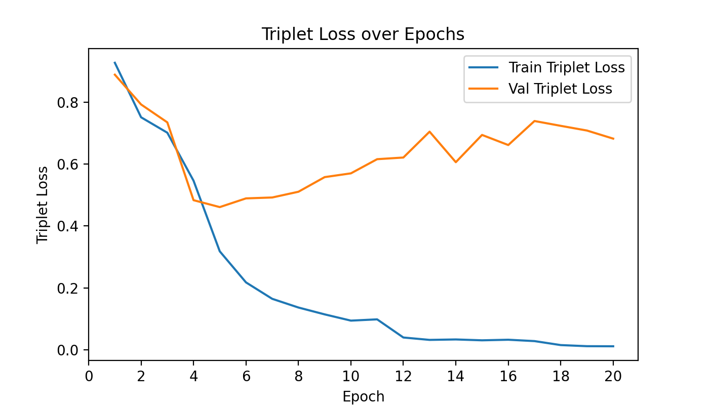
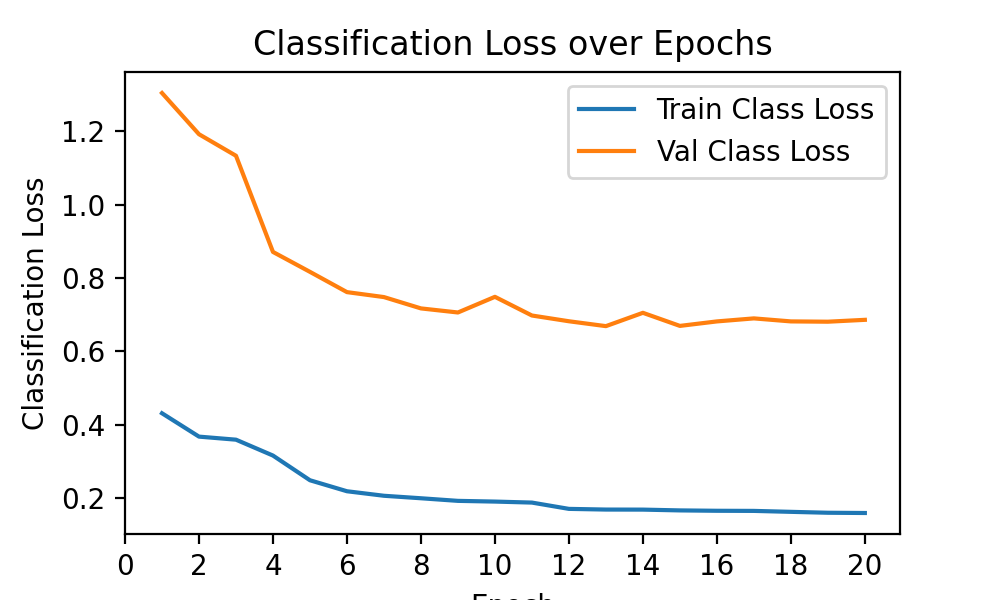
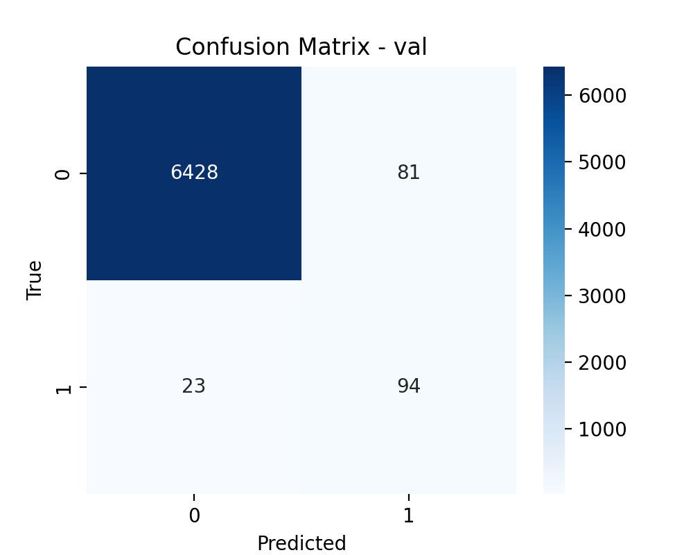
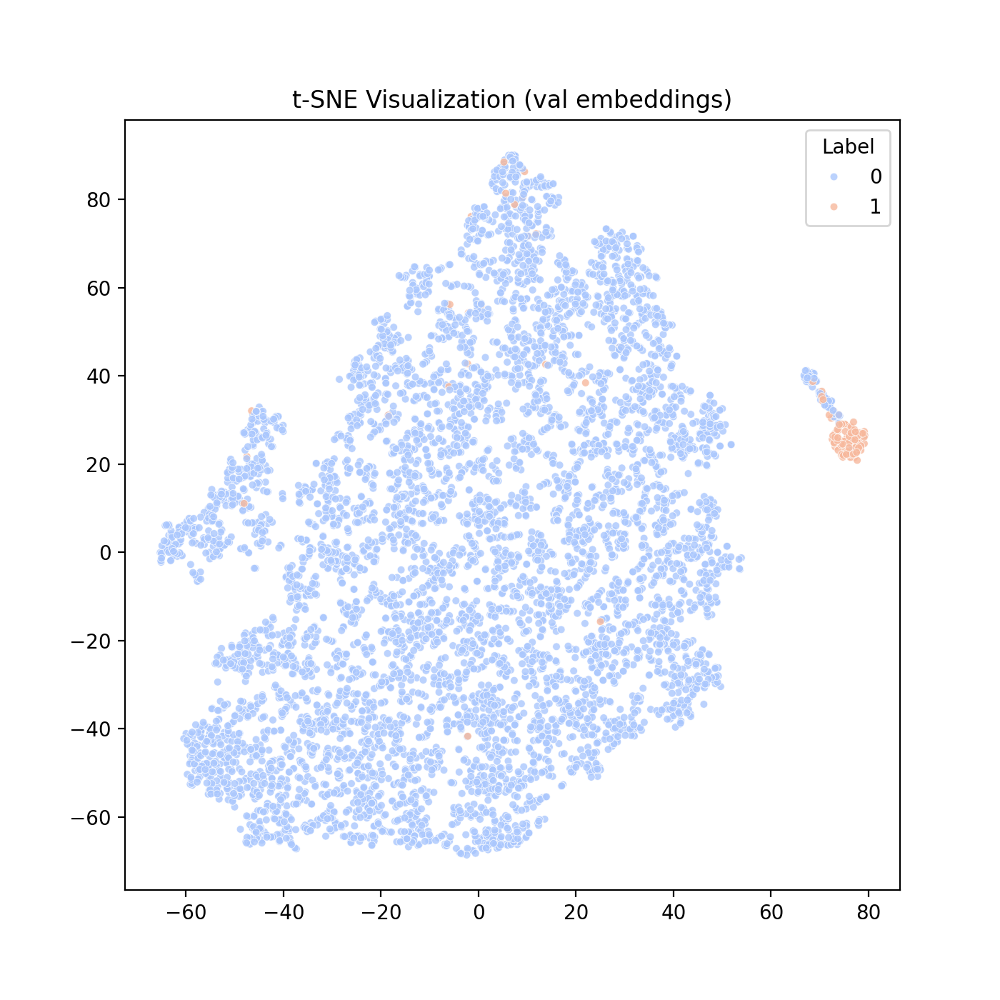

# Skin Lesion Analysis Towards Melanoma Detection using a Siamese Network

## Introduction

The aim of this project was to generate a solution to the
ISIC2020 Kaggle challenge dataset using a Siamese network 
for classifying skin lesions into two target categories
(benign and malignant) with a goal accuracy of 80%. 
There was a greater emphasis of making sure that the
malignant accuracy was also equally high, as this dataset
is largely imbalanced and the regular accuracy metrics
were easily skewed. 

## Environment setup

Miniconda was used for setting up a virtual environment for this solution for Python 3.12.9. However this setup
process may also be replicated by using anaconda for the same effect. The setup process is as 
follows:

1. Install [miniconda](https://www.anaconda.com/docs/getting-started/miniconda/install) or [anaconda](https://www.anaconda.com/download)
2. Create a virtual environment of a chosen name using the following ('envname' is a placeholder)

    ```
    conda create -n envname python=3.12.9
    conda activate envname
    ```

3. Install the following packages were used in this project. You may use pip or conda to do so
    - PyTorch: 2.7.1 (With CUDA 11.8 support)
    - torchvision: 0.22.1
    - scikit-learn: 1.6.1
    - matplotlib: 3.10.3
    - seaborn: 0.13.2
    - pandas: 2.2.3
    - numpy: 2.2.6

## Running the Project

> [!IMPORTANT]
> Raw image data must be provided for data partitioning to work.
>
> Place the raw images and the `train-metadata.csv` file  
> from [Kaggle ISIC 2020 Resized Dataset](https://www.kaggle.com/datasets/nischaydnk/isic-2020-jpg-256x256-resized/data)  
> into a directory named: `data/raw/`

Run the files in the following order:
1. dataset.py (This sets up data partitions) 
2. train.py (generates `epoch_metrics.csv` for loss/accuracy values per epoch)
3. predict.py (generates plots under `metrics/` directory)

## Data preprocessing

No explicit test dataset was provided for this solution, so the resized training set
from Kaggle was repurposed and split into training and validation sets
in proportions of 80/20. A resized version of the dataset was used for this
project, mainly to reduce the sizes of the images and to reduce
runtimes and processing times. This can be found here: 
https://www.kaggle.com/datasets/nischaydnk/isic-2020-jpg-256x256-resized/data.

The initial dataset was split into benign and malignant samples
with respect to the target classes provided in the `data/raw/train-metadata.csv`
file and placed into the `data/processed/` folder into two seperate folders
for each class.

### Class Ratios (Benign : Malignant lesions)

Stratification was performed on the dataset during splitting to ensure class distributions
remained the same across both the training and validation sets due to the large class imbalance
of the dataset (around 50:1 benign to malignant). A more accurate
breakdown of these ratios can be found by running the `train.py` script in 
the project.

Custom weighted random sampling using the `WeightedRandomSampler` was 
used to generate samples for the dataset. Regular randomised
oversampling was also trialled, however this lead to a more clear
trend of overfitting and was hence discared for this version

### Data Augmentation

Strong augmentations were applied to the
training set of the data as follows:

    - Random Horizontal flip
    - Random vertical flip
    - Colour jitter (brightness, contrast, saturation, hue)
    - Random rotations

This was most notably due to all of the pictures having being
taken in variable environments, such as lighting differences,
skin tone, perspective or hair folliclies covering the area
of interest. These augmentations were performed in addition to
normalisation of the data. Normalisation was also applied
to the validation set of the split. 

Example: Two different malignant classified images
from the full dataset.




## Network Architecure

### Siamese Network 

Siamese networks are a type of neural network architecture
consisting of two mirrored / identical sub networks that 
have identical parameters and weights; i.e the exact same model
Siamese networks take an input of a triplet (anchor, positive, negative)
structure where the anchor is some given image with a class, positive
is another image with the same class as the anchor and negative is an 
image with an opposing class of the anchor. Using this, Siamese 
Networks generate an output of a distance metric, comparing how similar
inputs provided to the two sub networks are. This idea can be extrapolated
to perform binary classification.

The Siamese network used in this project consists of a ResNet34 backbone, 
with preset with default weights, followed by a custom embedding head with
five layers as follows:

1. Linear layer (ResNet output → 512 units).
2. Batch Normalization.
3. ReLU activation.
4. Dropout (p=0.4).
5. Linear layer (512 → embedding_dim, typically 256), followed by another Batch Normalization.

The resulting embeddings are L2-normalized to ensure comparable distance magnitudes. 
This module outputs 256-dimensional feature vectors which were used as inputs into the 
binary classifier network.




### Binary Classifier Network 

A seperate network was implemented to use the embeddings
generated by the Siamese network and generate a majority
class prediction on if the provided image was a benign or
malignant image. Similar to the previously mentioned Siamese
Network, this was implemented in the `modules.py` file. 
This classifier contains five layers:

1. Linear layer (embedding_dim → hidden_dim, typically 256 → 128).
2. Batch Normalization.
3. ReLU activation.
4. Dropout (p=0.5).
5. Output Linear layer (128 → 2), producing logits for the two classes.


### Loss functions 

#### Triplet Loss

Triplet loss was used as the primary loss
function for this task (for the siamese network)
Triplet loss uses the same triplets mentioned before, 
(anchor, positive, negative) and returns a value
that can be used as a metric to measure similarity. 
Specifically this project used the native pytorch
implementation of `TripletMarginLoss`.

```
L(a,p,n)=max{d(ai​,pi​)−d(ai​,ni​)+margin,0}

where:
d(xi,yi)=∥xi−yi∥p
```



#### Cross Entropy Loss

Cross entropy loss was used as the loss function 
of choice for the network succeeding the siamese
network that takes embeddings as input and produces
a class prediction.

## Model Training

Model training was implemented in `train.py`
Run the following script to begin the training process

```
python train.py
```

Relevant metrics calculated during epoch runtime 
will be saved under `metrics/epoch_metrics.csv` such as
train loss values, validation accuracies etc. 

These can be run in the `predict.py` script by 
running the file

In regards to the metrics used to evaluate performed, 
it was important to stay away from using the regular accuracy
metric, as this is equally weighted by all factors, ie (true pos, true neg etc).
Considering a real life application sense, this kind of problem would benefit
from a slight bias towards predicting the malignant lesions correctly. 
For example, if a benign lesion was to be predicted malignant by a system
like this in practice, a specialist can simply check this to be the case
in person. However, if the opposite occurs - if we predict benign on a 
malignant lesion this has possibilities be catastrophic for a potential
patient as cancers are generally best treated as early as possible. 

Recall was tried as a metric for this, in order to push the network
into predicting the malignant cases more often, but this was compromised
the overall balanced accuracy too much by pushing it under 80%. As an alternative
we use balanced accuracy as the main metric to maximize for the mode. 


### Parameters and configurations

The following hyperparameters and configurations
were used for the model
    - Loss Function: Triplet Margin Loss
    - Optimizer: Adam
    - Hyperparameters: Refer to `config.py`


## Model Evaluation

Graphs made for analyis will be stored under the `metrics` folder after running the `predict.py` script

## Results

Potential Inflated numbers in these curves occur
due to with replacement weighted random sampling
from the dataset to help balance out the samples 
between the classes.

### Balanced accuracy curves



This curve shows that the goal of reaching an 
accuracy of 80% was met. However, this occured during
the 5th epoch, and all epochs following this had a 
drop in accuracy for the validation set, whereas the 
training set accuracy continued to increase. This is a
strong indicator that the model is still overfitting, 
regardless of the precautions previously taken to attempt
to minimise this value such as using dropouts or weighted
learning rate scheduler decay. Therefore considering the accuracy 
values were met, the training loop is not well optimised to 
generate meaningful improvemens throughout the epochs and hence
the model at epoch 5 was used for all results, considering it's 
superior generalisation performance pertaining to the validation
set. 

### Loss Curves





Loss curves for both the siamese network and
the binary classifier that generates targets
given embeddings can be seen above. Namely, the triplet
loss curve supports the the previous suggestion that 
the model is overfitting, more specificallyy the siamese
network that generates the embeddings as even though the
training loss continually improves, the validation loss
can be seen increasing after around epoch 5. Alternatively, the
class loss curve had steady decreases of losses across all
epochs suggesting that the main issue behind the overfitting
problem is a sub-optimally tuned siamese network that generates
embeddings too reliant on the training set. 

### Confusion Matrix



From the confusion matrix above on 

### t-Sne Plot



The following plot is for the validation set. It shows 
the feature seperation between the two target labels 
for the skin lesions. This can be seen to mostly be 
well seperated, and the goal of minimising 
malignant class mislabelling was mostly met. The
mislabelling for benign as malignant is not as 
significant, as in a real world sense, these can be 
easily double checked by a specialist. However, 
there were still a few malignant labels that were
classified as benign well into the feature 
space of the benign class.


## Conclusion and Future avenues of exploration

Overall the goal of the task was met. The model reached a balanced 
accuracy of approximately 85% on the validation set. However this implementation
had severe overfitting problems, which prevent the model from improving in performance. 
The secondary objective was partially met, as the majority of malignant lesions
were classified correctly as seen in the feature seperation and the confusion matrix; 
there were still a more than optimal number malignant samples mislabelled as benign
that would negatively affect this additional aim.

1. ResNet50: This could be used for potential performance improvements at the cost of increased training time. 
(Cino et al., 2025) had success with using a ResNet50 for this task for around eight different types of lesion
classifications
2. Use the full non resized dataset: This follows from the first idea.
The non resized original dataset also included additional features
such as general location on the skin, age or current diagnosis may provide useful insights to the 
model in order to generate more meaningful predictions. However the disadvantage of this is that the 
non resized model is extremely large ~ 50 Gb and processing and training times would be exponentially higher.
3. More epochs and attempts to further reduce overfitting: The current epoch number of 20 is a 
relatively small number that  prevents the bigger picture from being seen. This was particularly chosen due to the problem of overfitting, (optimal result) was much earlier in the epochs, it would still be a better idea to attempt
for a larger epoch value to see a clearer trend.

## References 

1. Benhur, S. (2022, January 25). A Friendly Introduction to Siamese Networks | Built In. Builtin.com. https://builtin.com/machine-learning/siamese-network
2. Cino, L., Distante, C., Martella, A., & Mazzeo, P. L. (2025). Skin Lesion Classification Through Test Time Augmentation and Explainable Artificial Intelligence. Journal of Imaging, 11(1), 15–15. https://doi.org/10.3390/jimaging11010015
3. Nag, R. (2022, November 19). A Comprehensive Guide to Siamese Neural Networks. Medium. https://medium.com/@rinkinag24/a-comprehensive-guide-to-siamese-neural-networks-3358658c0513
4. Pykes, K. (2024, January 11). Cross-Entropy Loss Function in Machine Learning: Enhancing Model Accuracy. Datacamp.com; DataCamp. https://www.datacamp.com/tutorial/the-cross-entropy-loss-function-in-machine-learning 
5. PyTorch Contributors. (2023). TripletMarginLoss. Pytorch.org. https://docs.pytorch.org/docs/stable/generated/torch.nn.TripletMarginLoss.html 
6. Shah, D. (2023, April 14). Triplet Loss: Intro, Implementation, Use Cases. Www.v7labs.com. https://www.v7labs.com/blog/triplet-loss
7. TheNoZER0. (2024). PatternAnalysis-2024/recognition/Siamese-48008361/dataset.py at topic-recognition · TheNoZER0/PatternAnalysis-2024. GitHub. https://github.com/TheNoZER0/PatternAnalysis-2024/blob/topic-recognition/recognition/Siamese-48008361/dataset.py 